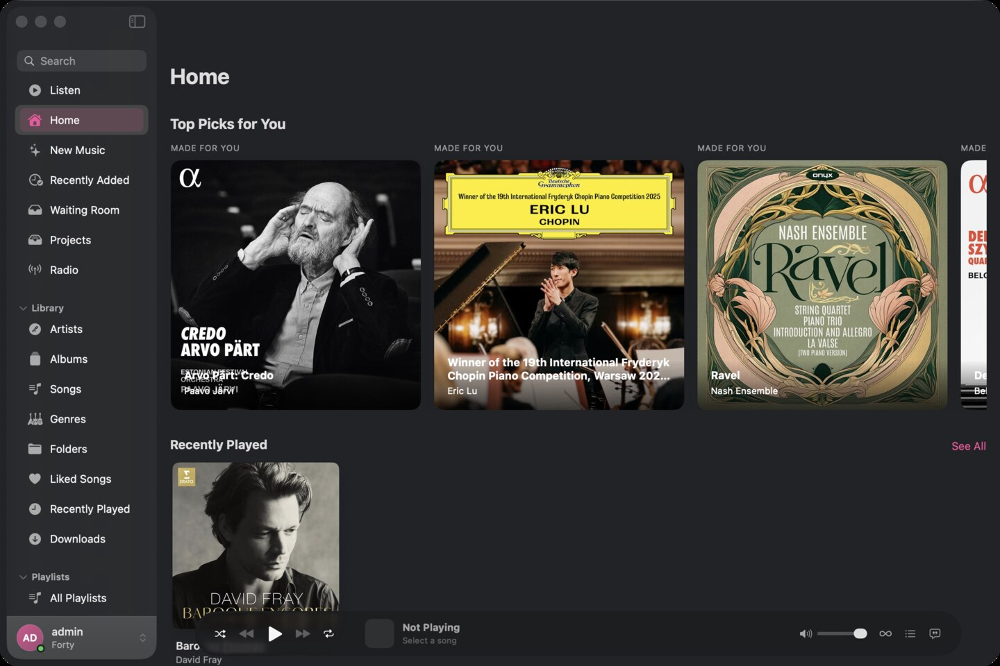

# Resonance

Resonance is an experimental native macOS client for Navidrome, made to bring
music hoarding into the streaming era. It is built in Swift and SwiftUI around
large personal libraries, album-first listening, and the parts of collecting
that streaming software usually flattens away.

## Download

Download the latest macOS showcase build from
[GitHub Releases](https://github.com/mduncs/resonance-app/releases/latest).

The showcase build requires macOS 14 or newer. It uses an isolated bundle ID,
app-data directory, cache, and keychain service, so it can live beside my
private development build without touching its data or credentials.

This build is permanently limited to its local demo Navidrome service at
`127.0.0.1:4534`. It cannot connect to another server. The local service and
the Forty demo music library are not included in the download or this
repository.

## What it does

- browses large Navidrome libraries as albums, artists, songs, genres, and folders
- keeps listening, queue, lyrics, ratings, favorites, and offline-library tools native to the Mac
- turns source collections into working projects for deciding what belongs
- offers a spatial album plane for navigating a collection beyond lists and grids

This repository distributes the showcase build and release notes. Source
publication is a separate decision.
