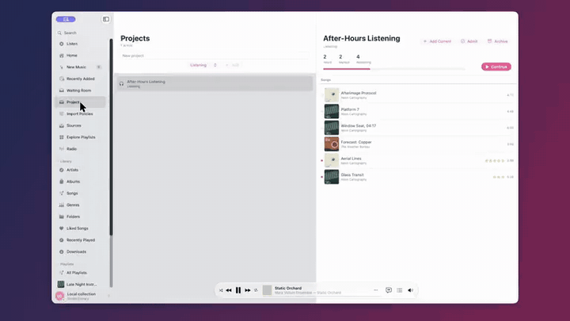

<p align="center">
  
</p>

## Hello, human

There's a need for a middle ground between the boomer media hoarder and the zoomer stream it all. This software is supposed to be meeting my needs for that, specifically letting me amass my hoard but also, there was a hope it was help me chunk through it. As of now, that part of the design has failed. Otherwise, its a pretty good navidrome client that looks and feels like Apple music. Chop it up as needed 

---

*The rest of this README was written by an AI model (Claude Opus 5.5) from the code in this repository.*

### Why this is public

Resonance is personal software. I built it with AI coding agents for my own use: a native Mac player for listening to a large personal music library on Navidrome and deciding what belongs in it. I'm publishing it because there's no reason not to.

Consider it a courtesy. If you, or an agent working for you, are building something similar, there may be something useful here. It isn't supported, and I won't be testing it on other setups or promising fixes. The tokens have been spent; this is me giving some back.

<p align="center">
  
</p>

## What it is

Resonance is a native macOS music player written in Swift and SwiftUI. It plays music from a [Navidrome](https://www.navidrome.org) server over the Subsonic API. It is built for large libraries and album-first listening, and its main idea is curation. New music waits in a staging area, gets auditioned, and is then admitted to the library or rejected. Projects group the music you are working through.

This repository is the **showcase build**. It only talks to a local demo server at `http://127.0.0.1:4534` and cannot be pointed anywhere else.

## Features

**Curation**
- **Waiting Room**: music that isn't in the library yet. Playing a song here counts as an audition. Resonance counts plays and listening time, and moves each song from unheard to partly heard, heard and replayed.
- **Admit / Reject**: admitting adds the song, album and artist to the library. Rejecting hides the song and remembers the decision. Single keys drive it: `j`/`k` move, `a` admit, `r` reject, `p` project, Space audition.
- **Projects**: collections with Heard / Marked / Remaining progress, plus Continue, Admit all and Archive.
- **Command HUD (⌘K)**: a searchable list of curation verbs (Capture, Mark, Project, Admit and others) that act on the playing song. Destructive verbs only appear once you type them.

**Listening and library**
- Queue, shuffle, repeat, crossfade, ReplayGain and selectable stream quality. The queue comes back paused at the next launch.
- A Now Playing bar, mini player, menu bar player and full-screen view, with media keys, Now Playing and AirPlay.
- Synced lyrics from the server, with the current line highlighted and tap-to-seek.
- Albums, Artists, Songs, Genres, Folders, Playlists, Radio, Recently Added and Similar Songs. Large libraries load in pages.
- Smart playlists with 17 fields and "in the last" date rules.

**Things a short demo doesn't show**
- **One Plane** (experimental, off by default): a zoomable album surface with four distances, Constellation, Shelf, Object and Player.
  - Albums sit in lanes, and auditions sit on a dashed strip.
  - The most-played covers get a wear ring, and new arrivals glow for a week.
  - A project lens narrows the plane to one project.
  - Turn it on with `defaults write com.resonance.public enableOnePlane -bool true`.
- **Apple Music import**: reads `~/Music/Library.xml` and turns loved songs into local likes and play counts into history.
- **Screenshot fixtures**: `RESONANCE_PARITY_*` environment variables run the interface on a synthetic catalog with no server. Network, keychain and scrobbling are switched off in this mode.

## Requirements

- macOS 14 (Sonoma) or newer, on Apple silicon or Intel. The build is universal (arm64 and x86_64).
- A [Navidrome](https://www.navidrome.org) server (Subsonic API) running on `127.0.0.1:4534` with your own audio. No music is included.
- To build from source: Xcode 16 or newer (Swift 6). The only dependency is [GRDB](https://github.com/groue/GRDB.swift), which SwiftPM fetches.

## Install

Download `Resonance-1.1.zip` from [Releases](https://github.com/mduncs/resonance-app/releases/latest), unzip it and move Resonance to Applications.

The build is unsigned: it's ad-hoc signed and not notarized by Apple, so macOS blocks it the first time. Open it once, then go to System Settings → Privacy & Security and click **Open Anyway**. Or build it from source (below), or have your agent do it.

Then start a demo server against a folder of your own audio:

```bash
brew install navidrome
ND_DEVAUTOCREATEADMINPASSWORD=demo navidrome \
  --address 127.0.0.1 --port 4534 \
  --musicfolder ~/Music/demo \
  --datafolder "$HOME/Library/Application Support/Resonance Public Demo"
```

The app signs in as `admin` / `demo` on its own. `demo/` has a Navidrome config and a launch agent for running the server in the background.

## Build from source

```bash
xcodebuild -project Resonance/Resonance.xcodeproj -scheme Resonance \
  -configuration Release build
swift test --package-path Resonance
```

The Xcode project is generated from `Resonance/project.yml` with XcodeGen and is committed. You only need XcodeGen if you add or remove files.

## Main shortcuts

Space play/pause, ⌘← / ⌘→ previous/next, ⌘F search, ⌘K command HUD, ⌘L lyrics, ⌘U queue, ⇧⌘M mini player, ⇧⌘F full screen, ⇧⌘A admit.

## How it works

- `NetworkActor` makes the Subsonic calls with token-and-salt auth.
- `CacheActor` keeps artwork, audio and lyrics on disk within size limits.
- `PlaybackManager` and `AudioActor` play audio through AVPlayer.
- Curation decisions, play history and projects live in a local SQLite database (GRDB). They are not written back to Navidrome.
- `resonance-mgmt/` is a small Bun/TypeScript companion for tagging and fingerprinting jobs. It is unfinished and the app doesn't need it.

## Data and privacy

- **Network**: the app only connects to `http://127.0.0.1:4534`. Other hosts, ports, HTTPS, redirects and off-host radio streams are refused in code. It has no telemetry and no external lyrics or artwork lookups. The policy is `PublicDemoConfiguration` in `AppState.swift`, and `PublicShowcaseIdentityTests` covers it.
- **Storage**: `~/Library/Application Support/Resonance Public/` and `~/Library/Caches/Resonance Public/`, keychain service `com.resonance.public.server`, bundle ID `com.resonance.public`. These names keep it apart from any other install.
- **Files**: the demo library is read-only, so Delete from Library is disabled.

## Limitations

- It only connects to the local demo server.
- There is no EQ and no gapless playback, and a track plays only once it has fully downloaded.
- One Plane has no Settings toggle.
- Some views in the source are unused prototypes.

## License

MIT. See [LICENSE](LICENSE).

**Keywords:** Navidrome client, Subsonic API, OpenSubsonic, macOS music player, SwiftUI, Swift 6, GRDB, SQLite, AVPlayer, self-hosted music, personal music library, music curation, album-first listening, smart playlists, synced lyrics, LRC, ReplayGain, scrobbling, mini player, menu bar player, Apple Music Library.xml import, Bun, TypeScript, XcodeGen, music collecting, universal macOS app
